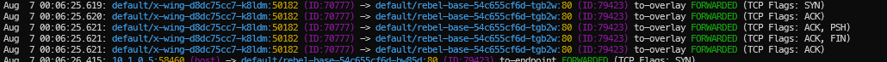
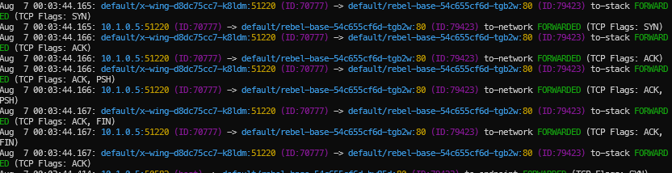
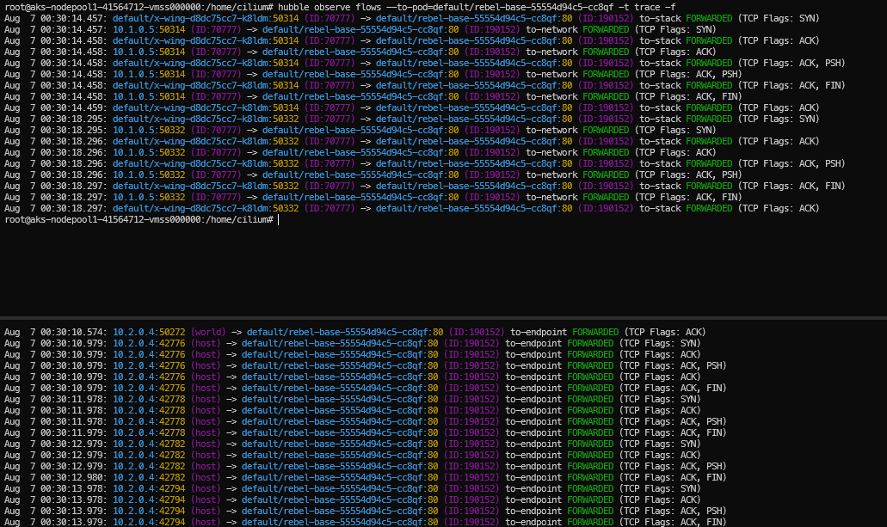
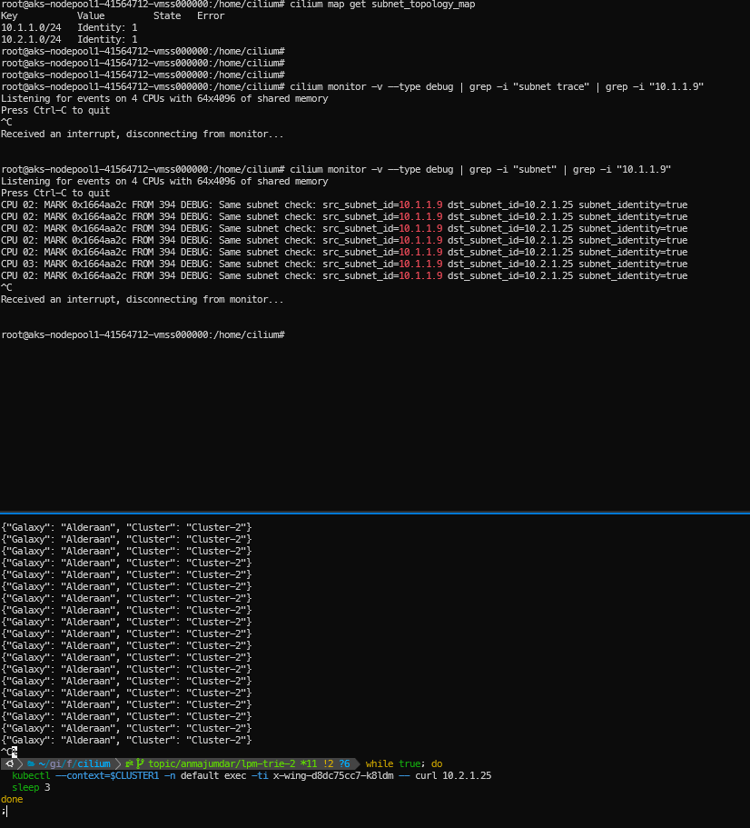
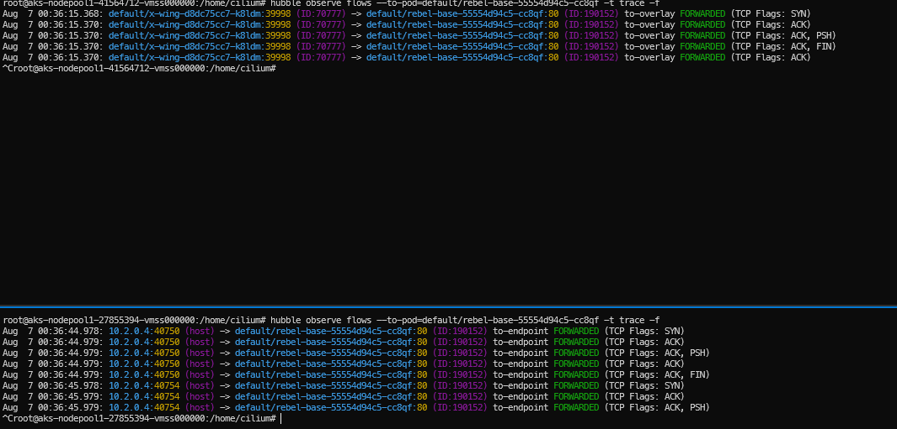
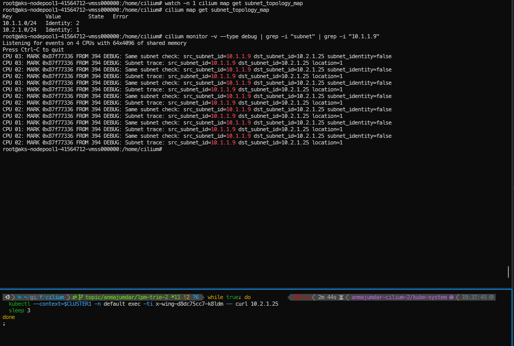

# Description

Work in progress change for adding hybrid routing. Derives from [this](https://github.com/cilium/design-cfps/blob/main/cilium/CFP-32810-hybrid-routing-mode.md) proposal.

## Datapath Changes Made

### 1. bpf/lib/subnet_topology.h (New File)

**Purpose**: Implements subnet topology awareness for hybrid routing mode.

**Key Components**:
- **subnet_key struct**: Defines the key structure for LPM trie lookups with BPF LPM trie key and IPv4 address
- **subnet_value struct**: Contains the subnet identity associated with the subnet
- **subnet_topology_map**: BPF LPM trie map that stores subnet-to-identity mappings
  - Type: `BPF_MAP_TYPE_LPM_TRIE` for longest prefix matching
  - Max entries: 1024 subnets
  - Pinned by name for persistence across program reloads
  - Uses `BPF_F_NO_PREALLOC` flag for dynamic memory allocation
- **subnet_identity_lookup() function**: Performs LPM lookup to find subnet identity for a given IPv4 address
  - Returns subnet identity if found, 0 if no match

### 2. bpf/bpf_lxc.c (Container/LXC Data Path)

**Purpose**: Modifies container egress path to implement hybrid routing decisions.

**Key Changes**:
- **Added include**: `#include "lib/subnet_topology.h"` for subnet topology functionality
- **Subnet topology logic in handle_ipv4_from_lxc()**:
  - Performs subnet identity lookups for both source and destination IPs
  - Determines if packets are within the same subnet using `subnet_identity_lookup()`
  - Sets `same_subnet` boolean flag when source and destination belong to same subnet (and not subnet 0)
  - Adds debug logging with `DBG_SUBNET_CHECK` to trace subnet decisions
- **Modified tunnel decision logic**:
  - Original: `skip_tunnel = info->flag_skip_tunnel`
  - Modified: `skip_tunnel = (info->flag_skip_tunnel) || same_subnet`
  - **Impact**: Packets within the same subnet bypass tunneling and use direct routing
- **Enhanced debug tracing**:
  - Added `DBG_TUNNEL_TRACE` debug points to track tunnel vs. routing decisions
  - Debug traces in both tunnel and routing code paths

### 3. bpf/bpf_host.c (Host Network Data Path)

**Purpose**: Modifies host network path to implement consistent hybrid routing behavior.

**Key Changes**:
- **Added include**: `#include "lib/subnet_topology.h"` for subnet topology functionality
- **Subnet topology logic in tunnel mode**:
  - Performs subnet identity lookups for source and destination IPs
  - Determines if traffic is within the same subnet
  - Sets `same_subnet` boolean flag for intra-subnet detection
- **Modified tunnel skip logic**:
  - Original: `if (info && info->flag_skip_tunnel)`
  - Modified: `if ((info && info->flag_skip_tunnel) || same_subnet)`
  - **Impact**: Host-routed packets within same subnet skip tunneling
- **Added debug tracing**:
  - `DBG_TUNNEL_TRACE` debug point to track routing decisions from host perspective

### 4. bpf/lib/dbg.h (Debug Constants)

**Purpose**: Adds new debug message types for hybrid routing observability.

**New Debug Constants**:
- **DBG_SUBNET_CHECK**: Logs subnet identity comparison
  - arg1: source subnet identity
  - arg2: destination subnet identity  
  - arg3: same_subnet boolean result
- **DBG_TUNNEL_TRACE**: Logs tunnel vs. routing path decisions

# Testing Done

## Single Cluster Testing

### Test Environment Setup

The testing was conducted on a single Azure Kubernetes Service (AKS) cluster with the following network topology:
- **Cloud Provider**: Microsoft Azure
- **Cluster Type**: AKS (Azure Kubernetes Service)
- **Network Configuration**: Pod and Node subnets deployed within the same Azure Virtual Network (VNET)
- **Subnet Architecture**: Separate subnets for pods and nodes, both residing in a single VNET to enable native routing capabilities

### Cilium Installation and Configuration

Cilium was deployed using a custom-built image containing the hybrid routing implementation. The installation command below shows the specific configuration parameters used:

```bash
cilium install -n kube-system cilium cilium/cilium --version v1.18.0 \
    --set azure.resourceGroup="<RESOURCE-GROUP>" \
    --set aksbyocni.enabled=false \
    --set nodeinit.enabled=false \
    --set hubble.enabled=true \
    --set envoy.enabled=false \
    --set cluster.id="<ID>" \
    --set cluster.name="<NAME>" \
    --set ipam.mode=delegated-plugin \
    --set routingMode=native \
    --set endpointRoutes.enabled=true \
    --set enable-ipv4=true \
    --set enableIPv4Masquerade=false \
    --set kubeProxyReplacement=true \
    --set kubeProxyReplacementHealthzBindAddr='0.0.0.0:<PORT>' \
    --set extraArgs="{--local-router-ipv4=<IP>} {--install-iptables-rules=true}" \
    --set endpointHealthChecking.enabled=false \
    --set cni.exclusive=false \
    --set bpf.enableTCX=false \
    --set bpf.hostLegacyRouting=true \
    --set l7Proxy=false \
    --set sessionAffinity=true
```

**Key Configuration Highlights**:
- `routingMode=native`: Initially configured for native routing to establish baseline behavior
- `ipam.mode=delegated-plugin`: Uses Azure CNI for IP address management
- `hubble.enabled=true`: Enables network flow observability for testing verification
- `bpf.hostLegacyRouting=true`: Enables legacy routing mode for compatibility with Azure networking

### Test Scenarios and Results

#### Phase 1: Baseline Native Routing Verification

**Objective**: Establish baseline behavior with native routing before introducing hybrid functionality.

**Steps Performed**:
1. **Application Deployment**: Deployed an `nginx` DaemonSet across multiple nodes to ensure test pods are distributed
2. **Connectivity Testing**: Executed manual curl commands to verify:
   - **Intra-node communication**: Pod-to-pod communication within the same node
   - **Inter-node communication**: Pod-to-pod communication across different nodes

**Results**:
- ✅ Above connectivity tests continued to pass
- **Hubble Flow Observations**: For inter-node traffic, Hubble consistently showed `to-stack` and `to-network` flows, indicating native routing was functioning correctly
- **Expected Behavior**: This confirms that Azure VNET routing is properly configured and traffic flows directly through the Azure network infrastructure

#### Phase 2: Tunnel Mode Baseline Testing

**Objective**: Verify tunnel mode behavior before enabling hybrid routing to establish comparison baseline.

**Steps Performed**:
1. **Configuration Change**: Modified Cilium configuration to use `routingMode=tunnel`
2. **Restart**: Restarted the Cilium DaemonSet to apply the new routing mode
3. **Connectivity Re-testing**: Repeated the same connectivity tests performed in Phase 1

**Results**:
- ✅ Above connectivity tests continued to pass
- **Hubble Flow Observations**: For inter-node traffic, Hubble now showed `to-overlay` flows instead of `to-stack/network`
- **Expected Behavior**: This confirms the tunnel encapsulation was working correctly, with all inter-node traffic being encapsulated and routed through Cilium's overlay network

#### Phase 3: Hybrid Routing Activation and Testing

**Objective**: Test the core hybrid routing functionality by introducing subnet topology awareness.

**Steps Performed**:
1. **Subnet Topology Configuration**: Applied the `subnet-topology` ConfigMap containing the subnet-to-identity mappings
2. **eBPF Map Synchronization**: Waited for the eBPF LPM trie map to synchronize with the new subnet topology data
3. **Flow Behavior Verification**: Monitored Hubble flows to observe the routing behavior changes
4. **Debug Verification**: Used custom debug messages (`DBG_SUBNET_CHECK` and `DBG_TUNNEL_TRACE`) to verify internal decision-making logic

**Results**:
- ✅ Hybrid routing activated successfully
- **Hubble Flow Observations**: Inter-node traffic within the same subnet began showing `to-stack/network` flows (native routing)
- **Behavior Validation**: Traffic between pods in the same subnet bypassed tunneling and used direct Azure VNET routing
- **Debug Log Verification**: Custom debug messages confirmed:
  - Subnet identity lookups were functioning correctly
  - Same-subnet detection logic was working as expected
  - Tunnel bypass decisions were being made appropriately

#### Phase 4: Dynamic Configuration Testing

**Objective**: Verify that hybrid routing can be dynamically enabled and disabled without service disruption.

**Steps Performed**:
1. **Configuration Removal**: Deleted the `subnet-topology` ConfigMap
2. **eBPF Map Cleanup**: Waited for the eBPF map to synchronize and clear subnet topology data
3. **Behavior Reverification**: Monitored traffic flows to confirm fallback to tunnel mode

**Results**:
- ✅ Dynamic configuration changes worked seamlessly
- **Hubble Flow Observations**: After ConfigMap deletion, inter-node traffic reverted to showing `to-overlay` flows
- **Behavior Validation**: System correctly fell back to full tunnel mode when subnet topology information was unavailable
- **No Service Disruption**: All connectivity remained functional throughout the configuration changes

#### Phase 5: Debug and Observability Validation

**Objective**: Validate the custom debugging and observability features added for hybrid routing.

**Debug Features Tested**:
- **DBG_SUBNET_CHECK**: Verified logging of subnet identity comparisons with proper argument formatting
- **DBG_TUNNEL_TRACE**: Confirmed tracking of tunnel vs. routing path decisions

**Results**:
- ✅ All debug messages functioned correctly
- **Log Output Quality**: Debug messages provided clear visibility into the decision-making process
- **Troubleshooting Value**: Debug information proved valuable for understanding and verifying hybrid routing behavior

### Hubble Flows and Debug Logs - Single Cluster

The following screenshots demonstrate the different routing behaviors observed during testing:

**Scenario 1: Inter-node Traffic in Hybrid Routing (Tunnel Mode)**
When pods are in different subnets or subnet topology is not configured, traffic uses tunnel encapsulation:



*This image shows Hubble flows with `to-overlay` designation, indicating that traffic is being encapsulated and routed through Cilium's tunnel overlay network.*

**Scenario 2: Inter-node Traffic in Hybrid Routing (Native Mode)**
When pods are in the same subnet and subnet topology is configured, traffic bypasses tunneling:



*This image shows Hubble flows with `to-stack/network` designation, indicating that traffic is using direct Azure VNET routing without tunnel encapsulation.*

## Multi-Cluster Testing (Cluster Mesh)

### Test Environment Setup

**Cluster Architecture**:
- **Primary Cluster**: Single AKS cluster configured as described above
- **Secondary Cluster**: Identical AKS cluster configuration in a separate resource group
- **Network Connectivity**: Azure VNET peering established between the two cluster VNETs to enable cross-cluster communication
- **Service Mesh**: Cilium Cluster Mesh enabled to provide cross-cluster service discovery and load balancing

### Cluster Mesh Configuration

**Steps Performed**:
1. **Cluster Mesh Enablement**: Followed the official Cilium documentation for [Cluster Mesh setup](https://docs.cilium.io/en/stable/network/clustermesh/clustermesh/)
2. **Cluster Connection**: Connected both clusters using the Cilium Cluster Mesh connectivity protocols
3. **Status Verification**: Confirmed successful setup using `cilium clustermesh status` command, which reported "OK" status
4. **Service Configuration**: Deployed the cross-cluster service example from the [official documentation](https://docs.cilium.io/en/stable/network/clustermesh/services/)
5. **Subnet Topology Application**: Applied the `subnet-topology` ConfigMap to both clusters to enable hybrid routing across the mesh

### Hybrid Routing Architecture in Cluster Mesh

The following diagram illustrates how hybrid routing operates with this change in a multi-cluster environment:


*This architectural diagram shows the complete hybrid routing system across multiple clusters, illustrating how subnet topology awareness enables intelligent routing decisions between native VNET routing and tunnel encapsulation based on cross-cluster subnet relationships.*

**Key Components Explained**:
- **Cluster Mesh Gateway**: Handles inter-cluster traffic routing decisions
- **Subnet Topology Awareness**: Each cluster maintains its own subnet-to-identity mappings
- **Cross-Cluster Routing Logic**: Traffic routing decisions are made based on both source and destination subnet identities across clusters
- **Fallback Mechanism**: If subnet topology information is unavailable or clusters are in different VNETs without peering, traffic automatically falls back to tunnel mode

### Multi-Cluster Test Scenarios and Results

The following test scenarios demonstrate hybrid routing behavior in cross-cluster communication, with corresponding Hubble flow visualizations and debug log outputs that validate the routing decisions made by the implementation.

#### Scenario 1: Cross-Cluster Communication with Same Subnet Topology

**Configuration**: Both clusters configured with identical subnet topologies, simulating pods in the same logical subnet across clusters.

**Test Results**:



*This Hubble flow visualization shows cross-cluster communication where pods are configured in the same logical subnet. The flows display `to-stack/network` designations, indicating that traffic is using native VNET routing across the cluster mesh without tunnel encapsulation.*



*Debug logs demonstrate the subnet identity lookup process and decision-making logic. The logs show successful same-subnet detection (identical subnet IDs) and the resulting tunnel bypass activation, confirming that the hybrid routing logic is correctly identifying and handling intra-subnet cross-cluster traffic.*

**Observations**:
- ✅ **Hubble Flows**: Show `to-stack/network` flows for cross-cluster communication
- ✅ **Debug Logs**: Confirm same-subnet detection and tunnel bypass logic activation

#### Scenario 2: Cross-Cluster Communication with Different Subnet Topology

**Configuration**: Clusters configured with different subnet topologies, simulating pods in different logical subnets across clusters.

**Test Results**:



*This Hubble flow visualization shows cross-cluster communication where pods are configured in different logical subnets. The flows display `to-overlay` designations, indicating that traffic is being encapsulated and routed through Cilium's tunnel overlay network due to the different subnet configurations.*



*Debug logs illustrate the subnet identity comparison process where different subnet IDs are detected. The logs show the decision-making logic that results in tunnel encapsulation being maintained, demonstrating the security-first approach when pods are in different logical subnets across clusters.*

**Observations**:
- ✅ **Hubble Flows**: Show `to-overlay` flows for cross-cluster communication
- ✅ **Debug Logs**: Confirm different-subnet detection and tunnel encapsulation activation

### Testing Summary and Validation

**Overall Test Coverage**:
- **Single Cluster Scenarios**: ✅ Native routing, tunnel mode, and hybrid routing transitions
- **Multi-Cluster Scenarios**: ✅ Cross-cluster communication with both same and different subnet topologies
- **Dynamic Configuration**: ✅ Runtime configuration changes without service disruption
- **Debug and Observability**: ✅ Comprehensive logging and flow tracking capabilities
